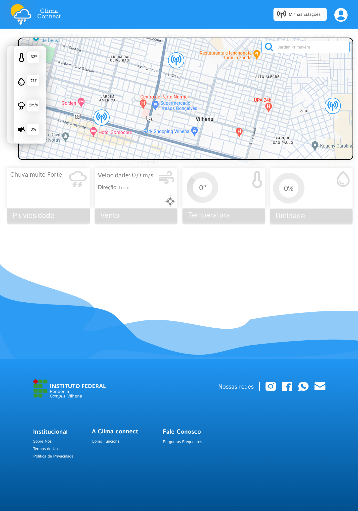
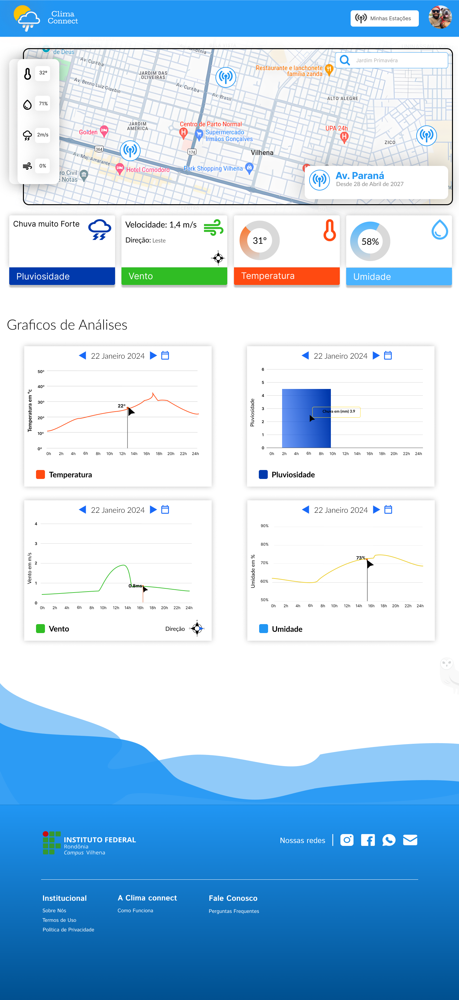
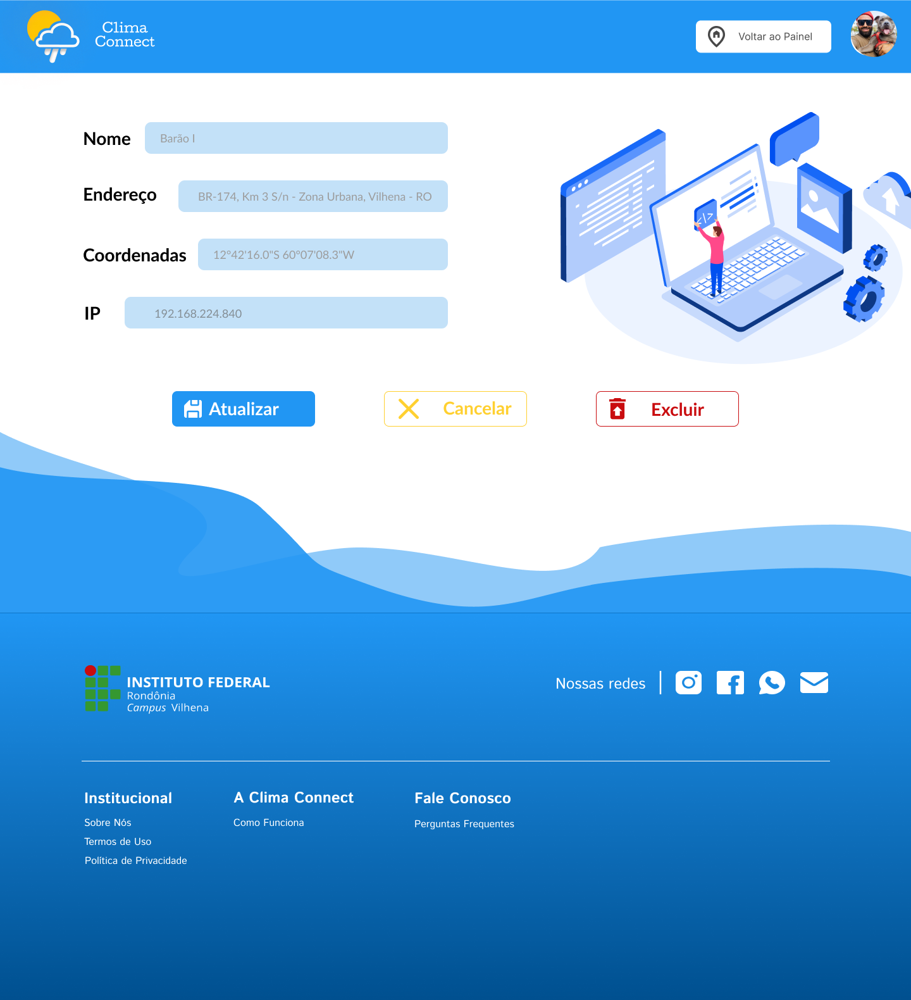

# DO PROJETO ESTAÇÕES METEOROLÓGICAS

## Link
https://www.com/file/w7XP6qLmQSVg3m9lu3BncL/Esta%C3%A7%C3%A3o-Meteorol%C3%B3gica-melestone1-FSLAB-2?type=design&node-id=1174%3A1740&mode=design&t=djmuzGQvoqUaVIzs-1

## Imagens

### pagina home - 1

### pagina home - 2

### pagina de cadastro de usuário

### pagina de login

### pagina minhas estações - 1

### pagina minhas estações - 2

### pagina minhas estações - 3

### pagina adicionar estação

### pagina editar estação

### pagina quem somos

### pagina 404

